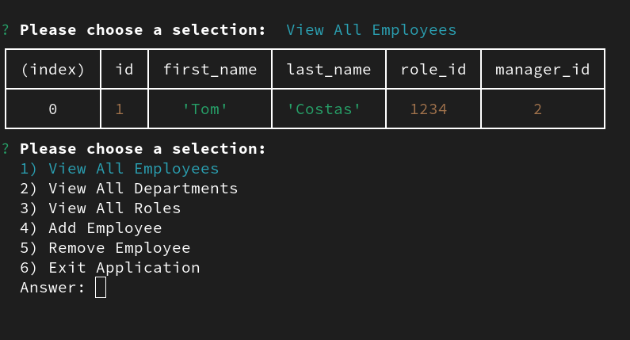

## A work in progress

--

# Employee-Tracker-Application

## Description

Create a command line program that lists, adds, and removes employees from a given organization or company.

---

## Table of Contents

    * Description
    * Installation
    * Site Structure
        - Develop direcotry
        - License information (MIT)
        - Site README.md
    * Usage
    * Contributing
    * Questions
    * PNG Screen shot
    * License

---

## Installation

    1. Create this repostiory by using the GitHub forking process onto your computer
    2. Install Node.js onto your computer
    3. Install Inquirer.js onto your computer
    4. Install NPM the Node Project Manager onto your computer
    5. NPM start to start the program

---

## Site Structure

1.  employee_App.js (main application code to run program)

2.  employeeDB.sql (main database for application)

3.  License information (MIT)

4.  Images directory

    - Employee-Tracker-Application - screenshot of command line application

5.  Site README.md

---

## Usage

This program is designed to create an employee tracking system.

Start the program with the following command "npm start".

---

## Contributing

GitHub Username - lucpizz

Please list your name here if you are contributing to this project.

---

## Questions

Please contact me at lucpizz@gmail.com for any questions regarding this program.

---

## Snapshot of Program

---

## License

MIT License

Copyright (c) 2021 Luca Pizzoferrato

Permission is hereby granted, free of charge, to any person obtaining a copy
of this software and associated documentation files (the "Software"), to deal
in the Software without restriction, including without limitation the rights
to use, copy, modify, merge, publish, distribute, sublicense, and/or sell
copies of the Software, and to permit persons to whom the Software is
furnished to do so, subject to the following conditions:

The above copyright notice and this permission notice shall be included in all
copies or substantial portions of the Software.

THE SOFTWARE IS PROVIDED "AS IS", WITHOUT WARRANTY OF ANY KIND, EXPRESS OR
IMPLIED, INCLUDING BUT NOT LIMITED TO THE WARRANTIES OF MERCHANTABILITY,
FITNESS FOR A PARTICULAR PURPOSE AND NONINFRINGEMENT. IN NO EVENT SHALL THE
AUTHORS OR COPYRIGHT HOLDERS BE LIABLE FOR ANY CLAIM, DAMAGES OR OTHER
LIABILITY, WHETHER IN AN ACTION OF CONTRACT, TORT OR OTHERWISE, ARISING FROM,
OUT OF OR IN CONNECTION WITH THE SOFTWARE OR THE USE OR OTHER DEALINGS IN THE
SOFTWARE.
